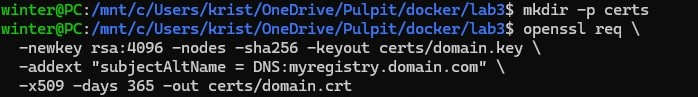
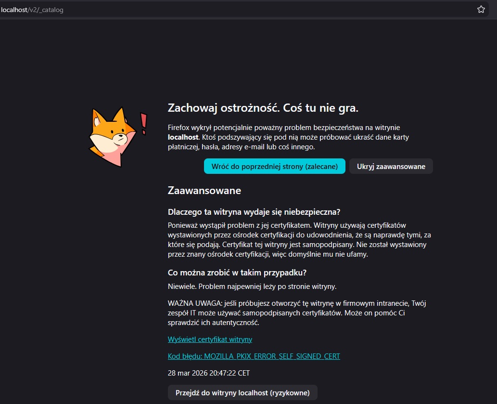
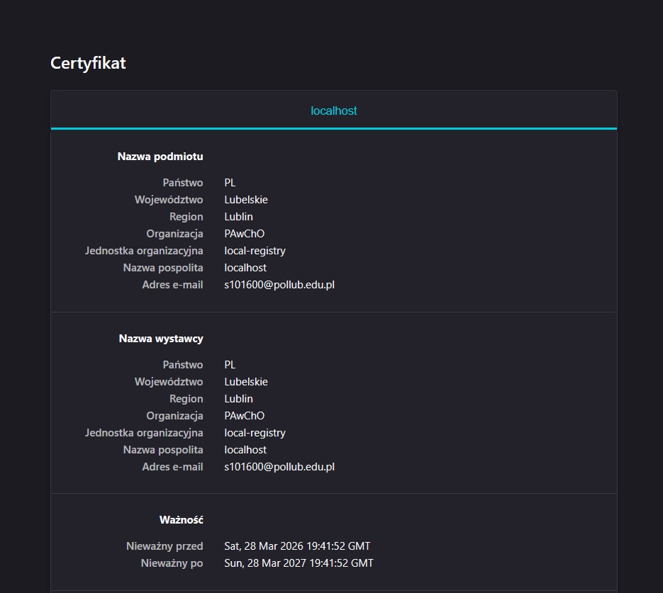
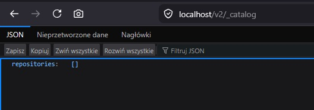
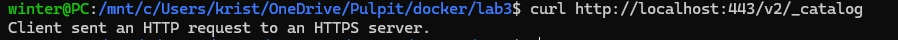
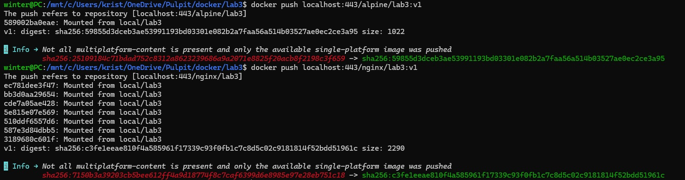
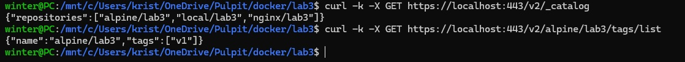
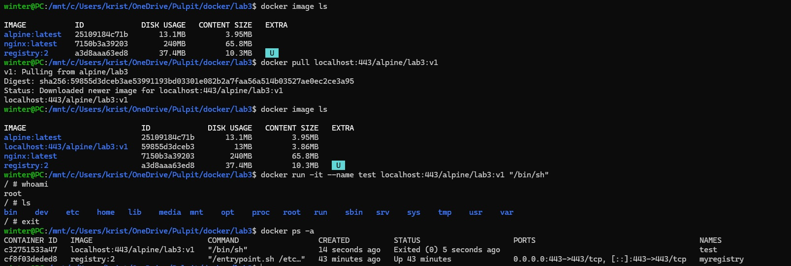
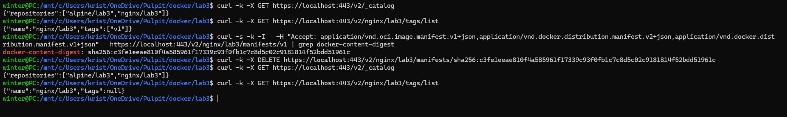

### Dodatkowe zadanie z laba 3

### Etap 1 

Utworzenie certyfikatu

### Etap 2

Utworzenie kontenera na podstawie obrazu registry:2, wskazanie kontenerowi ścieżki do certyfikatów (TLS)
    `docker run -d \
        -p 443:443 \
        --restart always \
        --name myregistry \
        -v "$(pwd)"/certs:/certs \
        -e REGISTRY_HTTP_ADDR=0.0.0.0:443 \
        -e REGISTRY_HTTP_TLS_CERTIFICATE=/certs/domain.crt \
        -e REGISTRY_HTTP_TLS_KEY=/certs/domain.key \
        registry:2`

Dla szybszego działania używane tutaj jest w curl -k, ale żeby wchodzić przez certyfikat należy użyć komendy:
` curl --cacert ./certs/domain.crt \
  --insecure \
  https://localhost:443/v2/_catalog`
  
Po wejściu do lokalnego repozytorium pod adresem: https://localhost/v2/_catalog:
lub `curl -k -X GET https://localhost:443/v2/_catalog`:
        {"repositories":[]}

Próba połączenia się bez certyfikatu:
`curl http://localhost:443/v2/_catalog`
Client sent an HTTP request to an HTTPS server.

### Etap 3

Stworzenie obrazów przykładowych (1 obraz to pusty alpine latest a 2 to nginx)
Stagowanie ich w odpowiedni sposób:
$ `docker tag nginx localhost:443/nginx/lab3:v1`
$ `docker tag alpine localhost:443/alpine/lab3:v1`

### Etap 4 

Teraz należy wrzucić (push) dane do repozytorium lokalnego
komendy:
`$docker push localhost:443/alpine/lab3:v1`
`$docker push localhost:443/nginx/lab3:v1`

### Etap 5

Sprawdzenie czy zostały dodane obrazy do rejestru

### Etap 6

Pobranie obrazu z rejestru i uruchomienie go w kontenerze (prosty kontener interaktywny alpine) - działa, ponieważ można korzystać z alpine w oczekiwany sposób

### Etap 7 

Żeby usuwać komendami nie wchodząc do kontenera lokalnego rejestru ani nie usuwać poprzez resetowanie rejestru należy z etapu 2 zmodyfikować kod:
`docker run -d \
  -p 443:443 \
  --restart always \
  --name myregistry \
  -v "$(pwd)"/certs:/certs \
  -e REGISTRY_STORAGE_DELETE_ENABLED=true \ #dodana linia
  -e REGISTRY_HTTP_ADDR=0.0.0.0:443 \
  -e REGISTRY_HTTP_TLS_CERTIFICATE=/certs/domain.crt \
  -e REGISTRY_HTTP_TLS_KEY=/certs/domain.key \
  registry:2`

Została dodana komenda `-e REGISTRY_STORAGE_DELETE_ENABLED=true` i ustawiona na true
Teraz po resecie rejestru, żeby usunąć obraz należy znaleźć "Digest" obrazu (unikalny id/manifest) komendą:
    `curl -s -k -I   -H "Accept: application/vnd.oci.image.manifest.v1+json,application/vnd.docker.distribution.manifest.v2+json,application/vnd.docker.distribution.manifest.v1+json"   https://localhost:443/v2/nginx/lab3/manifests/v1 | grep docker-content-digest`

Usunięcie z lokalnego rejestru obrazu po znalezieniu sha256 w docker-content-digest:
    `curl -k -X DELETE https://localhost:443/v2/nginx/lab3/manifests/sha256:c3fe1eeae810f4a585961f17339c93f0fb1c7c8d5c02c9181814f52bdd51961c`
Na zrzutach widać, że nazwa repozytorium została, ale tag, czyli obraz został usunięty

