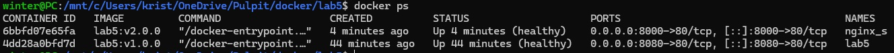
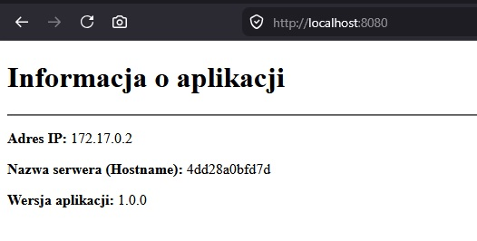
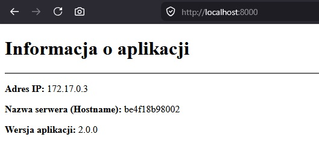

### Opis

Projekt (sprawozdanie) lab 5 - prosta strona internetowa, która wyświetla informacje o adresie ip serwera (adres prywatny), nazwę hosta serwera (hostname) oraz wersje aplikacji, która jest definiowana w czasie budowania obrazu. 

### Pliki (dockerfile i inne)

Ten plik jak i inne pliki znajdują się w tym katalogu "lab5" oraz w podkatalogu src. Należy zachować strukturę plików w katalogach przy budowaniu.

### Dockerfile

Plik Dockerfile został skonstruowany z wykorzystaniem metody wieloetapowego budowania obrazów.
W pierwszym etapie proces budowy rozpoczyna się od całkowicie pustego obrazu bazowego (scratch), do którego dodany jest wybrany system alpine (Intel). Później dodawana jest zmienna do tworzenia `VERSION` z domyślną wartością `1.0.0`. Następnie kopiowane są potrzebne typu: .html, .js. Następnie wykorzystywany jest obraz bazowy Nginx (serwer) wraz z jego plikiem konfiguracyjnym. Plik script.js jest skonfigurowany pod działanie na Nginx. Na koniec w obrazie Nginx pobierany jest curl, który służy do sprawdzania stanu HEALTHCHECK.

### Budowanie 

Do budowy obrazu potrzebne są wszystkie pliki z katalogu src.
Budowanie:
    `docker build --build-arg VERSION=2.0 -t lab5:v2.0.0 .`
    --build-arg opcjonalnie i po -t własna nazwa dowolna
Wynik działania tej komendy (zbudowanie obrazu o nazwie lab5 z tagiem v2.0.0):
    [+] Building 2.3s (16/16) FINISHED                                                                                                                                                                docker:default
    => [internal] load build definition from Dockerfile                                                                                                                                                        0.0s
    => => transferring dockerfile: 1.27kB                                                                                                                                                                      0.0s
    => [internal] load metadata for docker.io/library/nginx:1.27.0-alpine                                                                                                                                      0.8s
    => [auth] library/nginx:pull token for registry-1.docker.io                                                                                                                                                0.0s
    => [internal] load .dockerignore                                                                                                                                                                           0.0s
    => => transferring context: 412B                                                                                                                                                                           0.0s
    => [internal] load build context                                                                                                                                                                           0.0s
    => => transferring context: 221B                                                                                                                                                                           0.0s
    => [stage2 1/5] FROM docker.io/library/nginx:1.27.0-alpine@sha256:208b70eefac13ee9be00e486f79c695b15cef861c680527171a27d253d834be9                                                                         0.0s
    => => resolve docker.io/library/nginx:1.27.0-alpine@sha256:208b70eefac13ee9be00e486f79c695b15cef861c680527171a27d253d834be9                                                                                0.0s
    => CACHED [stage1 1/5] ADD ./src/alpine-minirootfs-3.23.3-x86_64.tar.gz /                                                                                                                                  0.0s
    => CACHED [stage1 2/5] WORKDIR /usr/app                                                                                                                                                                    0.0s
    => CACHED [stage1 3/5] COPY ./src/index.html .                                                                                                                                                             0.0s
    => CACHED [stage1 4/5] COPY ./src/js/script.js ./js/                                                                                                                                                       0.0s
    => [stage1 5/5] RUN echo 2.0 > version.txt                                                                                                                                                                 0.2s
    => CACHED [stage2 2/5] COPY ./src/default.conf /etc/nginx/conf.d/default.conf                                                                                                                              0.0s
    => CACHED [stage2 3/5] WORKDIR /usr/share/nginx/html                                                                                                                                                       0.0s
    => [stage2 4/5] COPY --from=stage1 /usr/app/ .                                                                                                                                                             0.1s
    => [stage2 5/5] RUN apk add --no-cache curl                                                                                                                                                                0.7s
    => exporting to image                                                                                                                                                                                      0.3s
    => => exporting layers                                                                                                                                                                                     0.2s
    => => exporting manifest sha256:bb6e3e1a522453235bf2090b8e9ab21b432d09fc9fc2bfe71be693a3b6b167f6                                                                                                           0.0s
    => => exporting config sha256:7ebaeed86e07b31b44bba39ee69f94c65026c12e478454be9624f0238b995437                                                                                                             0.0s
    => => exporting attestation manifest sha256:f26f3480d0d2deebb8006b8eac1bdf778347c25ff10b5fe46d8820a2f75c997e                                                                                               0.0s
    => => exporting manifest list sha256:56a5b5cfbd81807bcd6de568b3f4333eab265bb6c122559b43d6ab36656dee6d                                                                                                      0.0s
    => => naming to docker.io/library/lab5:v2.0.0                                                                                                                                                              0.0s
    => => unpacking to docker.io/library/lab5:v2.0.0

### Zbudowanie kontenera (uruchomienie serwera)

Komenda do zbudowania kontenera:
    `docker run -d -p 8000:80 --name nginx_s lab5:v2.0.0`
    --jako detached (działający w tle)
    --na porcie 8000 (zewnętrzny) - lub inny wybrany port
    --nazwa nginx_s - lub inna nazwa
    --na podstawie zbudowanego wyżej obrazu

### Sprawdzenie stanu kontenera (potwierdzenie jego działania poprawnego)

    `docker ps --filter "name=nginx_s"`
Na zrzucie ekranu jest użyte `docker ps`, ponieważ w momencie robienia zrzutu ekranu istnieją tylko kontenery zawierające ten obraz.
Status (healthy) wszystko działa dobrze
"
docker ps
CONTAINER ID   IMAGE         COMMAND                  CREATED          STATUS                    PORTS                                     NAMES
6bbfd07e65fa   lab5:v2.0.0   "/docker-entrypoint.…"   4 minutes ago    Up 4 minutes (healthy)    0.0.0.0:8000->80/tcp, [::]:8000->80/tcp   nginx_s
4dd28a0bfd7d   lab5:v1.0.0   "/docker-entrypoint.…"   44 minutes ago   Up 44 minutes (healthy)   0.0.0.0:8080->80/tcp, [::]:8080->80/tcp   lab5
"

### Zrzuty ekranu z poprawnego dziłania konterów w przeglądarce

### Zatrzymanie kontenera jezeli byl w trybie -d

    `docker stop nginx_s`
        lub inna nadana nazwa kontenera

### Obrazy na Docker  

[iwinter1/university-lab-lab5](https://hub.docker.com/r/iwinter1/university-lab-lab5)
