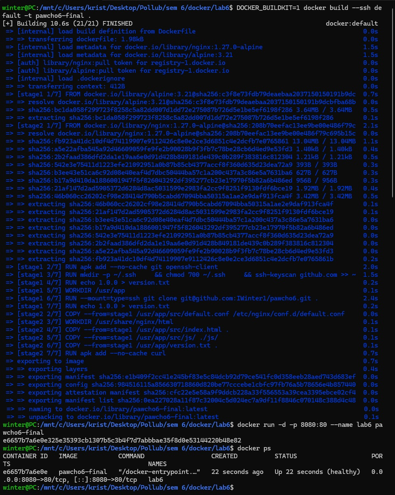
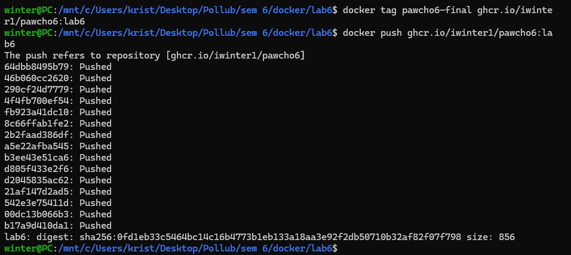
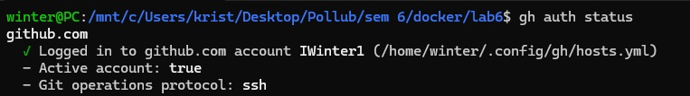
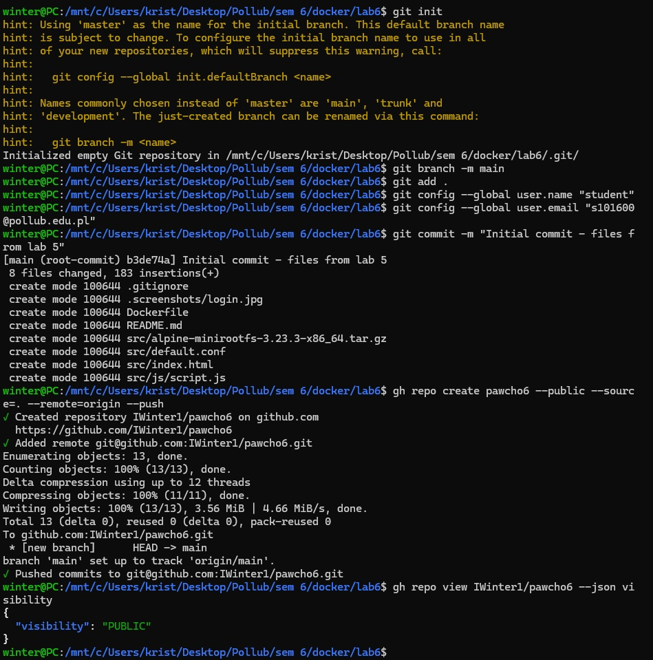
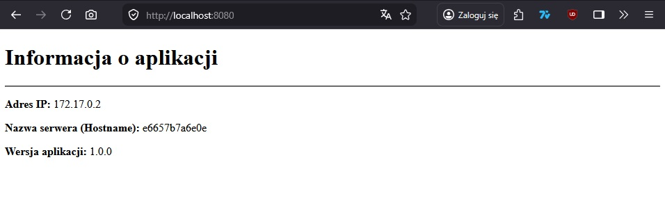
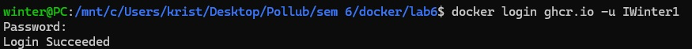
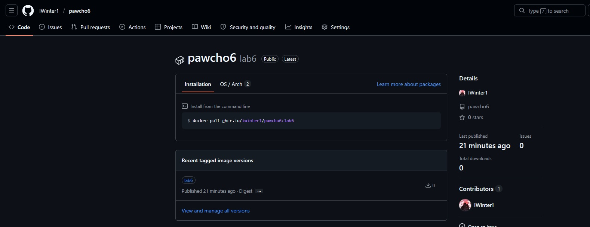
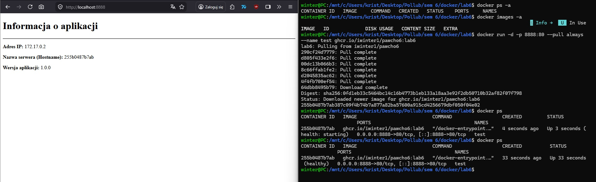

### Opis

Projekt (sprawozdanie) lab 6 - utworzenie repo publicznego na githubie przy użyciu "gh cli". Cały katalog z laba 5 został skopiowany do katalogu o nazwie "lab6", chociaż niektóre pliki można usunąc przed przesłaniem do repo na githubie tj. Dockerfile, README.md (to samo co w repo z laba 5), cały katalog .screenshots (wykorzystywany w README.md) oraz z katalogu src obraz alpine w .tar. Po etapie 1. zostało to wykonane, aby przy budowaniu obrazu nie były pobierane niepotrzebne pliki (śmieci). Następnie został zmodyfikowany Dockerfile, tak aby pełnił on rolę frontendu dla silnika BuildKit. Następnie na podstawie tego Dockerfile został stworzony obraz Docker, który w następnym kroku dostał tag: "lab6". Następnie został on przesłany na githuba, gdzie zmieniono go na "Public" oraz podłączono do odpowiedniego repo.

# Na samym dole tego pliku jest zachowana kolejność wykonywania zadań wraz z zrzutami ekranów

### Pliki (dockerfile i inne)

W tym katalogu znajduje się plik Dockerfile, natomiast inne pliki potrzebne do budowy obrazu znajdują sie w repo: [iwinter1/pawcho6](https://github.com/IWinter1/pawcho6)

### Dockerfile - znajduje się w tym repo

W pierwszym etapie proces budowy rozpoczyna się od lekkiego obrazu bazowego Alpine Linux (wersja 3.21). Następnie instalowane są w nim niezbędne pakiety (git oraz openssh-client) i konfigurowane są uprawnienia oraz klucze SSH, aby system ufał serwerom GitHuba. Pozwala to na bezpieczne sklonowanie repozytorium z kodem źródłowym bezpośrednio do katalogu roboczego kontenera, z wykorzystaniem zaawansowanego mechanizmu montowania kluczy SSH. W tym etapie definiowana jest również zmienna środowiskowa budowania `VERSION` z domyślną wartością `1.0.0`, która jest zapisywana do pliku tekstowego version.txt (jest to pokazane na stronie internetowej).

Następnie, w drugim etapie, wykorzystywany jest docelowy obraz bazowy Nginx (wersja 1.27.0-alpine), pełniący rolę serwera WWW. Do jego wnętrza kopiowany jest plik konfiguracyjny serwera ze sklonowanego wcześniej repozytorium. Później do docelowego katalogu roboczego Nginxa kopiowane są z pierwszego etapu wszystkie pliki statyczne potrzebne do działania strony (m.in. pliki .html, katalog skryptów .js oraz wygenerowany plik tekstowy z wersją).

Na koniec w gotowym obrazie instalowane jest narzędzie curl, które służy do cyklicznego sprawdzania stanu kontenera (HEALTHCHECK) odpytując serwer co 5 sekund. Kontener ma wystawiony port 80 i jest skonfigurowany tak, aby domyślnie uruchamiać serwer Nginx jako główny proces

### Budowanie 

`DOCKER_BUILDKIT=1 docker build --ssh default [--build-arg VERSION=2.0.0] -t pawcho6-final .`
    [build-arg] - opcjonalne

Na tym zrzucie ekranowym jest też potwierdzenia działania dla budowy kontenera i sprawdzenie jego stanu

### Stagowanie i przesłanie obrazu na gita
`docker tag pawcho6-final ghcr.io/iwinter1/pawcho6:lab6`

### Zbudowanie kontenera (uruchomienie serwera)

Komenda do zbudowania kontenera:
    `docker run -d -p 8080:80 --name lab6 pawcho6-final`
    --jako detached (działający w tle)
    --na porcie 8080 (zewnętrzny) - lub inny wybrany port
    --nazwa lab6 - lub inna nazwa
    --na podstawie zbudowanego wyżej obrazu

Zrzut ekranu w sekcji budowanie [Budowanie](#budowanie)   

### Sprawdzenie stanu kontenera (potwierdzenie jego działania poprawnego)

    `docker ps --filter "name=lab6"`
Na zrzucie ekranu jest użyte `docker ps`, ponieważ w momencie robienia zrzutu ekranu istnieją tylko kontenery zawierające ten obraz.

Zrzut ekranu w sekcji budowanie [Budowanie](#budowanie) 

### Zatrzymanie kontenera jezeli byl w trybie -d

    `docker stop lab6`
        lub inna nadana nazwa kontenera

### Zrzuty ekranu potwierdzające wykonanie zadań (zachowana kolejność zadania)

Poprawne zalogowanie do swojego konta github:

Wykonanie pierwszego etapu (utworzenie w cli repo publicznego)

Dodanie klucza do walidacji (przed budowaniem)

Budowanie obrazu i kontenera

Sprawdzenie działania kontenera

Logowanie w docker do githuba

Przesłanie obrazu na githuba

Zmiana obrazu na public oraz podpięcie do odpowiedniego repo

Przetestowanie działania obrazu (pobranie z githuba i uruchomienie)

