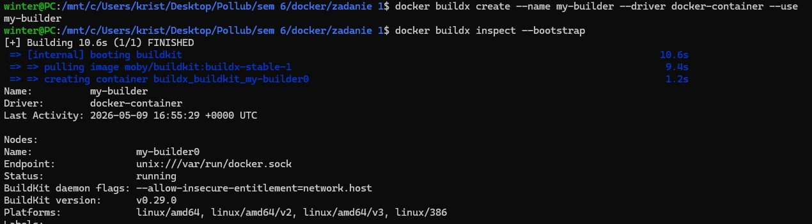
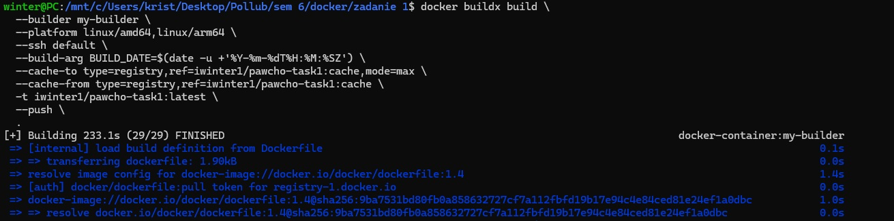
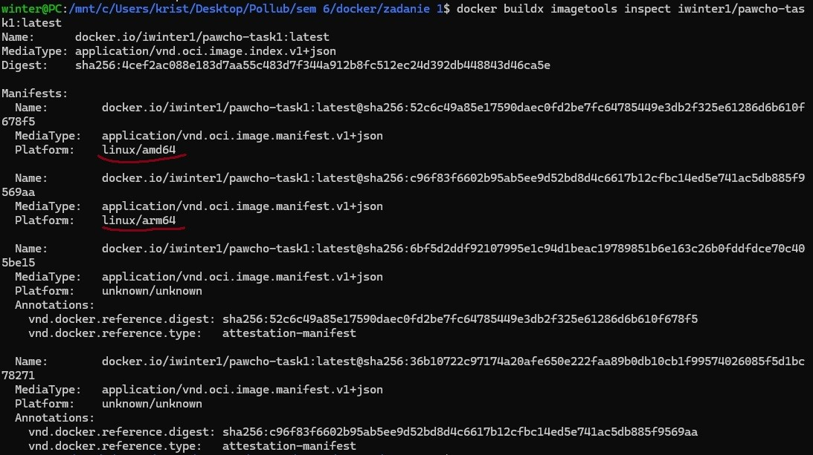
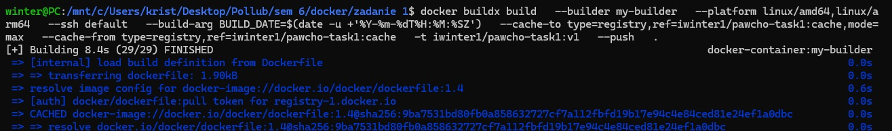
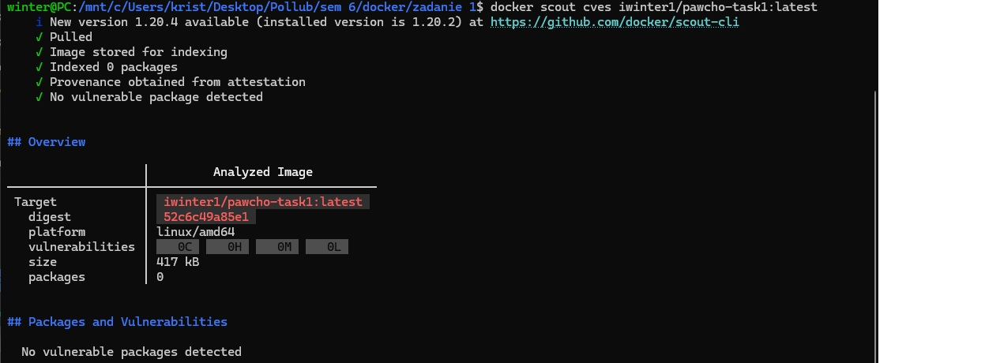
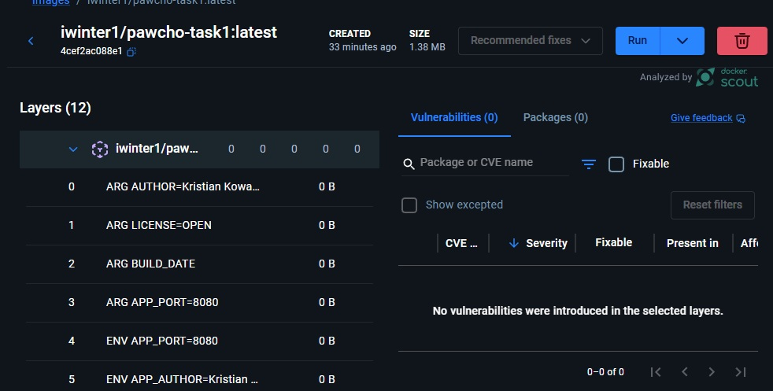

# Sprawozdanie - Zadanie 1 (Dodatkowe)

## 1. Wykorzystany Dockerfile
Zastosowano zaawansowany frontend BuildKit, funkcjonalność `mount ssh` do bezpiecznego klonowania kodu oraz `sparse-checkout`. Obraz końcowy bazuje na `scratch`.

### Dockerfile
[Dockerfile](./Dockerfile)

## 2. Builder i utworzenie obrazu na odpowiednie architektury (linux/amd64 oraz linux/arm64)

### Zrzuty potwierdzające utworzenie własnego buildera

Obraz został zbudowany przy użyciu buildera ze sterownikiem `docker-container`.

**Polecenie budujące:**
`docker buildx build   --builder my-builder   --platform linux/amd64,linux/arm64   --ssh default   --build-arg BUILD_DATE=$(date -u +'%Y-%m-%dT%H:%M:%SZ')   --cache-to type=registry,ref=iwinter1/pawcho-task1:cache,mode=max   --cache-from type=registry,ref=iwinter1/pawcho-task1:cache   -t iwinter1/pawcho-task1:latest   --push   . `

**Zbudowanie obrazu**

**Polecenie weryfikujące manifest:**
`docker buildx imagetools inspect iwinter1/pawcho-task1:latest`

**Wynik:**

## 3. Zarządzanie danymi cache - zbudowanie obrazu z wykorzystaniem cache
**Zbudowanie obrazu z wykorzystaniem cache (nowy tag v1 zamiast latest)**
W procesie budowy wykorzystano zdalny cache przesłany do DockerHub. Dzięki temu kolejne budowania są znacznie szybsze (status `CACHED`).

Po czasach budować obrazów widać wielki wpływ cache.

## 4. Analiza podatności (Docker Scout)

Przeprowadzono analizę bezpieczeństwa obrazu za pomocą polecenia `docker scout cves iwinter1/pawcho-task1:latest` — nie wykryto problemów (brak podatności).

**Wynik skanowania:**

**Wynik skanowania w Docker Desktop**

**Komentarz:** Brak podatności HIGH/CRITICAL wynika z minimalizmu obrazu (brak systemu operacyjnego w warstwie końcowej - są tam tylko skompilowane pliki cpp).

## 5. Linki do zasobów:

* **Repozytorium GitHub (Kod źródłowy i Dockerfile):** [https://github.com/IWinter1/ProgrammingInCloud-Docker-](https://github.com/IWinter1/ProgrammingInCloud-Docker-)
* **Repozytorium DockerHub (Obrazy OCI):** [https://hub.docker.com/r/iwinter1/pawcho-task1](https://hub.docker.com/r/iwinter1/pawcho-task1) - została włączona dla tego obrazu analiza na dockerhubie
