# Opis

#### Zostało wykonane zadanie 2 zgodnie z założeniami tj. został stworzony obraz na dwie architektury: linux/amd64 oraz linux/arm64 - trzecia opcja na githubie w packages tj. manifest list, który przekierowuje do odpowiedniego obrazu w zależności od systemu operacyjnego przy `pull` (pobraniu). Plik konfiguracyjny został skonfigurowany w następujący sposób:
#### Wykonuje się, gdy zajdą zmiany w katalogu z zadaniem 1 lub z zadaniem 2

# Wykorzystane pliki

#### Ponieważ w tym zadaniu zostały wykorzystane kody z "zadania 1", a na tym repo gromadzone są wszystkie pliki (zadania oraz sprawozdania) z przedmiotu PAWChO, to zamiast przenosi pliki do katalogu z zadaniem 2, zostało pobrane całe repozytorium z PAWChO `git clone link`, gdzie znajdują się pliki z "zadania 1", a następnie w pliku konfiguracyjnym (`yaml`) dla workflowa została wykorzystana odpowiednia ścieżka - /zadanie_1/czesc_1/.

 Link do tego katalogu [katalog](../zadanie_1/czesc_1)

# Tagowanie obrazów

#### Został wykonane tagowanie obrazu na 4 poziomach (jeden to po prostu nadanie tagu "latest") - z priorytetami (wykona się zawsze ten, który ma wyższy priorytet)
* type=schedule (priorytet: 100) - niewykorzystywane tutaj (ale można zaimplementować w przyszłości) - Jeśli potok zostałby uruchomiony z harmonogramu (tzw. cron), obraz otrzymałby tag z dzisiejszą datą, np. 20260530
* type=ref,event=branch (priorytet: 200) - jeśli zwykły kod zostanie przesłany na gałąź (np. main lub dev), obraz zostanie otagowany jej nazwą (np. ghcr.io/.../zadanie2:main)
* type=ref,event=pr (priorytet: 300) - jeśli zostanie utworzony "Pull request" (propozycja wprowadzenia zmian do kodu w repozytorium), to wtedy obraz dostaje tag (np. pr-12)
* type=raw,value=latest,enable={{is_default_branch}} (priorytet: 400) - gdy operacja dodania obrazu odbywa się na gałąź (branch) głównej, wtedy zostaje dopisany tag latest
* type=semver,pattern={{version}} (priorytet: 500) - jeśli zostanie utworzony tag, to wtedy zostanie tym tagiem nazwany obraz

##### Linki do źródeł - [GitHub](https://github.com/docker/metadata-action), [StackOverflow](https://stackoverflow.com/questions/72673143/github-workflows-how-do-i-additionally-tag-a-docker-image-when-building-only-on)

# Cache 

link - [DockerHub](https://hub.docker.com/r/iwinter1/zadanie2-cache/tags)
#### Cache jest zawsze przesyłany i odbierany z tego samego repozytorium na DockerHubie - nie jest robione to dynamicznie, aby oszczędzić czas - zawsze ma tag `main`

# Plik konfiguracyjny

link - [plik](../zadanie_2/zadanie_2_workflow.yml)

#### Etapy:

- Wyznaczenie, kiedy uruchamia się workflow
- Konfiguracja środowiska i uprawnień
- Przygotowanie silników i architektury (multi-arch)
- Uwierzytelnianie do DH i GH
- Budowanie próbne (lokalnie) i analiza bezpieczeństwa
- Budowanie ostateczne, cache'owanie i publikacja (push) - tutaj są wyznaczone architektury oraz cache

# Zrzuty ekranowe

Zalogowanie się do gh za pomocą klucza
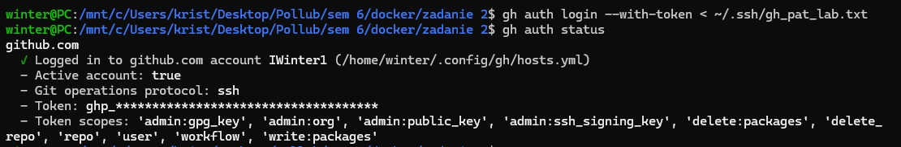

Zmiana sposobu komunikacji z repo na SSH
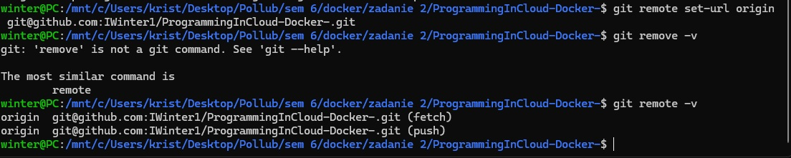

Sklonowanie repo z GH
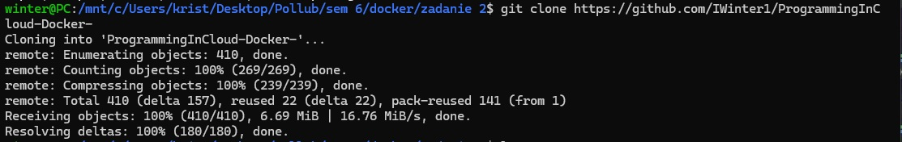

Dodanie zmiennych środowiskowych (do połączeń z GH i DH przy użyciu workflowa)
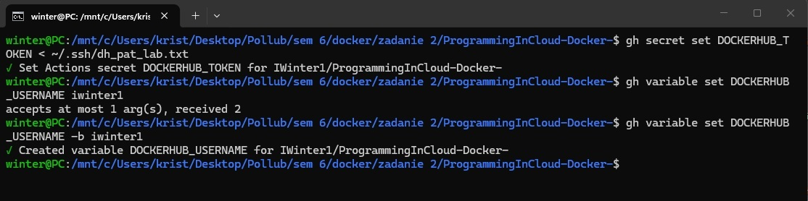
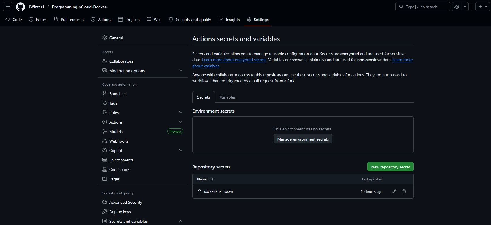

Utworzenie potrzebnych katalogów (później zostały edytowane pliki)
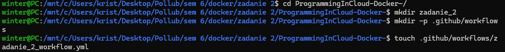

Dodanie do repo lokalnego wszystkie z katalogu oraz wysłanie wszystkich zmian do GH
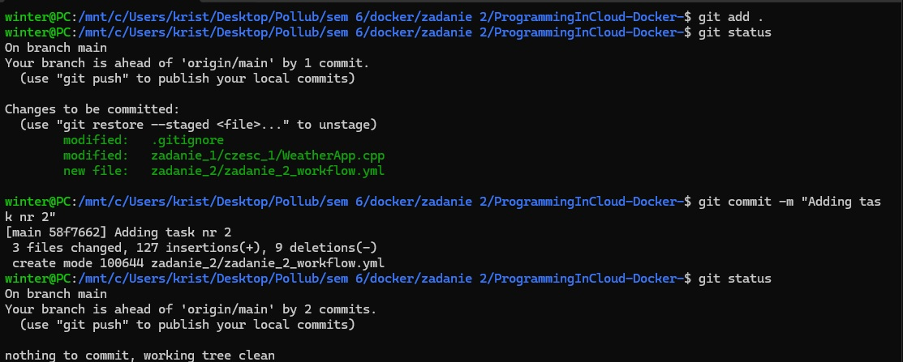
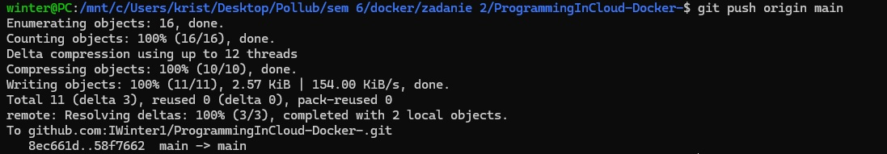

Wykonanie ręczne workflowa
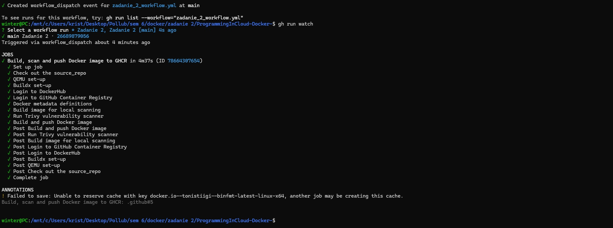

Sprawdzenie czy wystąpiły jakieś błedy krytyczne w "TRIVY"
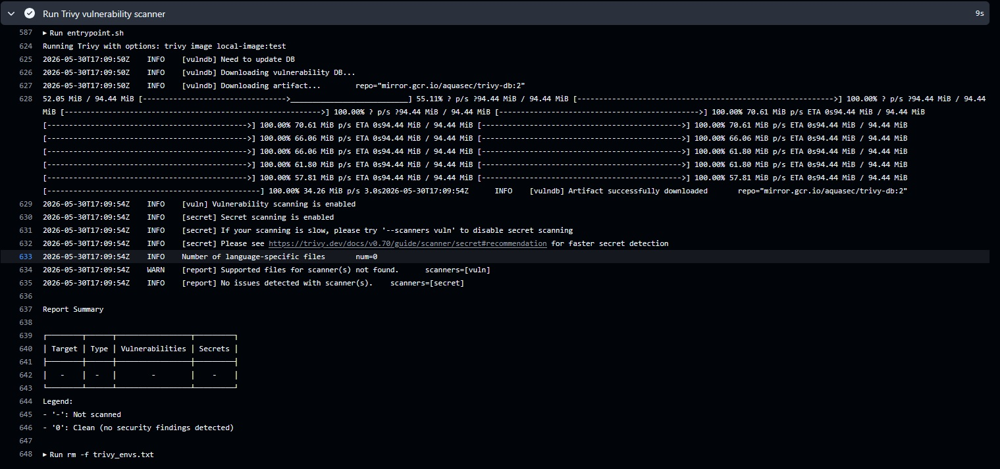

Sprawdzenie cache
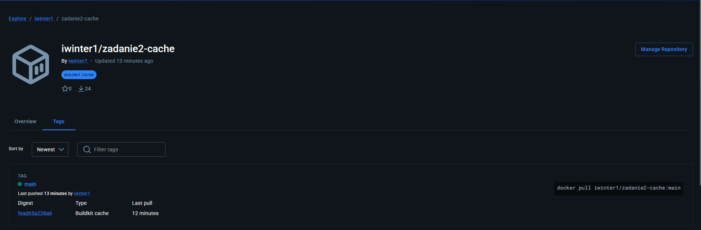

Wykonanie jeszcze raz workflowa z tagiem
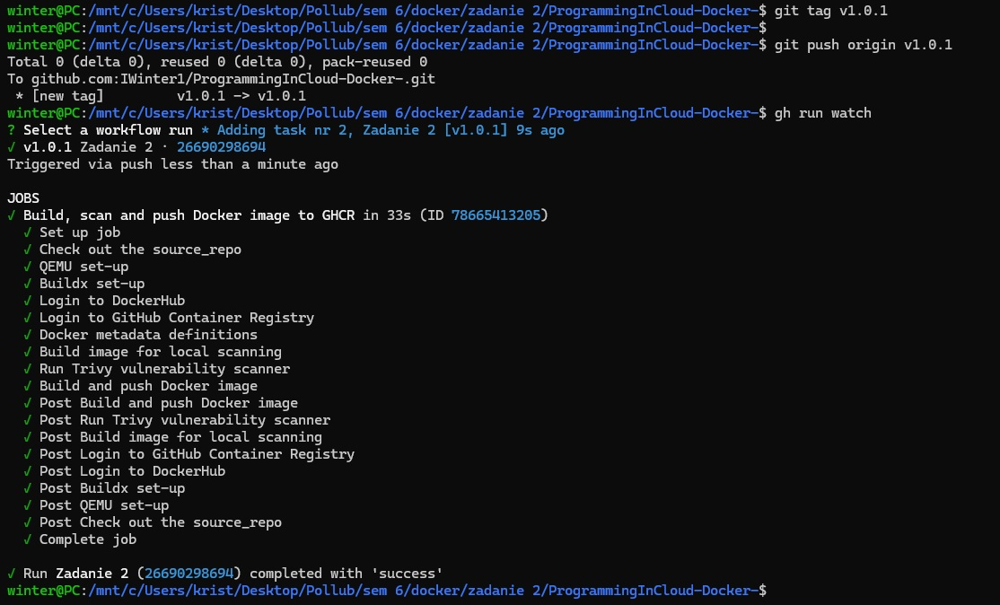

Sprawdzenie czy są dwa workflowy
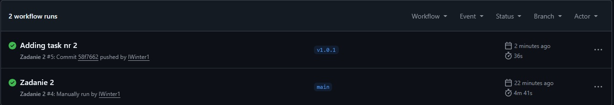

Sprawdzenie czy obraz posiada tagi
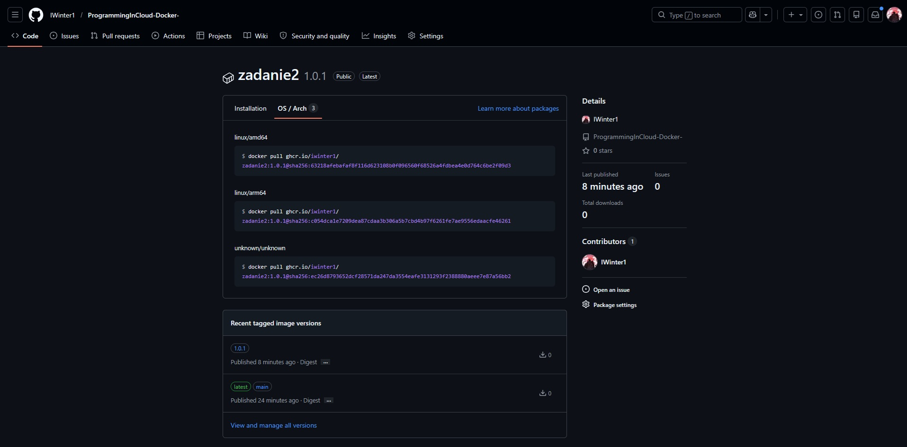

### Link do obrazu [Image](https://github.com/IWinter1/ProgrammingInCloud-Docker-/pkgs/container/zadanie2)

